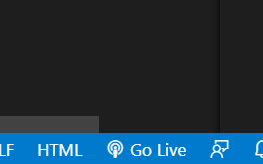

# Les 1 opdrachten

## git aanmaken

1. ga naar jouw github
2. maak een repository met naam `M2 prog js`

## Mappen aanmaken

1. Ga naar waar jouw school werk staat
2. clone jouw git repository (`M2 prog js`) naar de school map directory stap 1
3. git clone maakt nu een `M2 prog js` directory aan op jouw laptop
4. maak nu een `les1` directory aan in `M2 prog js`
5. Open deze `les1` directory in visual studio code

## Javascript ontwikkel omgeving opzetten

1. maak nu een file aan: `index.html`
2. maak nog een file aan: `app.js`

## basis code in files zetten

1. in `index.html` zet het volgende:
 

2. in `app.js` zet het volgende:

3. Lees/bedenk waar je jouw code straks moet zetten!

## live server installeren

Nu gaan we live server installeren

1. open je extensions (linker menu 4 blokjes)
2. zoek op live server
3. installeer deze: 

4. gebruik de knop `go live` om de server te starten

5. dat start de server en laat jouw index.html zien
 
## variabel opdracht:

We hebben nu een javascript begin

we gaan variabelen maken dat deed je zo
`let eenVariableNaam = waarde`
waarde kan een string zijn `"hello"` of andere dingen `true`, `99` etc

1. Maak deze variabelen aan in de runApplication function:

* appNaam (string)
* versienummer (0.9 double)
* versiedatum (Date)
* autheur (string)
* copyright (string)
* distributeur (string)
* darkmode (bool)

Deze doe je even zelf!

## console.log

Nu gaan we console.log(de_naam_van_de_variable) gebruiken:

1. print met `console.log(de_naam_van_de_variable)` alle variabelen van de vorige opdracht
2. open je developer tools van je browser
3. check of alles in de debug console staat!
