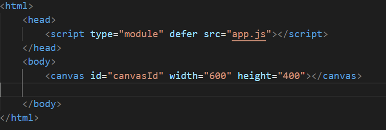
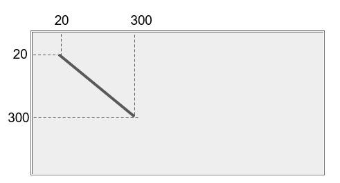
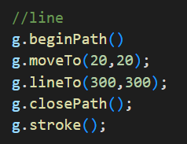
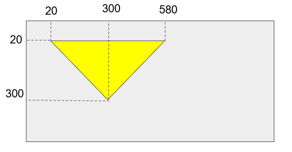
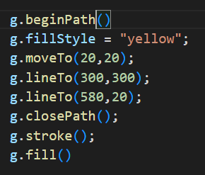
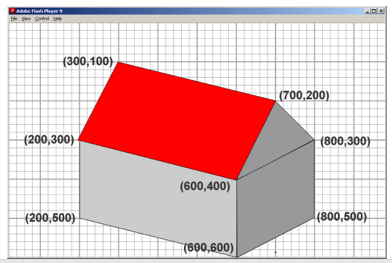
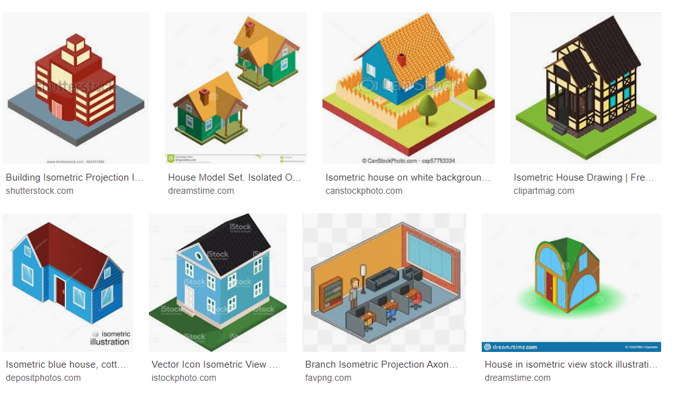

# Les 2 opdrachten

## Mappen aanmaken

1. Ga naar waar jouw school werk staat
2. Ga naar de map/directory `M2 prog js`”`
Uit de vorige les!
3. Maak een map `canvashuis`”`
4. Open de `canvashuis`”` folder in visual studio code

## files opzetten

1. Kopieer files van de vorige les naar 
 `canvashuis`

 * `index.html`
 * `app.js`

2. open de directory `canvashuis` in visual studio code

## html aanpassen
1. open index.html
2. zet een canvas tag in je body:

## javascript 

1. open app.js
2. maak een `variable` met de naam `canvas` (tip: `let eenVariableNaam = ...;`)

3. op de `...` gaan we nu met `document` aan de slag.
4. gebruik de `document.getElementById("...")` om het canvas uit de html te selecteren

5. kijk goed naar welke `id` je op de `...` moet invullen!

6. `console.log(canvas)` en kijk wat je ziet in de developer tools

##  canvas gebruiken:

Om te kunnen tekenen moeten we eerst een teken object vragen
dat doen we door `let g = canvas.getContext("2d");` in onze code te zetten

1. zet onder je `let canvas` de code van `getContext`
2. nu kunnen we tekenen: `g.fillRect(0,0,10,10);`
3. controlleer of je nu een zwart vierkant op je webpagina hebt

## lijnen tekenen:

plaatjes van `sjo`

* je start een Path met `beginPath()`
* dan beweeg naar het begin punt (`20,20 in het plaatje`) met `moveTo()`.
* dan geef je aan dat je een lijn naar een punt wil (`300,300 en 300,580 in het plaatje`) met `lineTo(x,y)`
* sluit het pad met `closePath()` en teken de lijn met `stroke`

1. maak deze code na en kijk of je een lijn krijgt:

## vormen tekenen:

vormen gaan op dezelfde manier, alleen gebruik je niet `stroke` maar `fill`
* je start een Path met `beginPath()`
* dan beweeg naar het begin punt (`20,20 in het plaatje`) met `moveTo()`.
* dan maak je lijnen van de vorm per punt wil (`300,300 in het plaatje`) met `lineTo(x,y)`
* sluit het pad met `closePath()` en teken de lijn met `fill`

1. maak deze code na:

## Huisje tekenen

Gebruik nu wat je hebt geprobeerd en geleerd

1. maak een huis
2. begin met deze, maar `let op` is je `canvas` groot genoeg?:

3. maak deze nu kleiner zodat deze in 100 bij 100 pixels past

4. dan vul dit kleinere huisje het aan met je eigen ideeen:

5. teken een raam want die heb je later nodig

## klaar?

1. commit & push je werk naar github

## handige canvas links
Deze zijn voor als je vast zit of als je wil weten HOE je iets moet doen

* [canvas javascript reference](https://www.w3schools.com/jsref/dom_obj_canvas.asp)
* [canvas tag reference](https://www.w3schools.com/tags/tag_canvas.asp)
* [canvas](https://www.w3schools.com/html/html5_canvas.asp)
* [canvas intro](https://www.w3schools.com/graphics/canvas_intro.asp)
