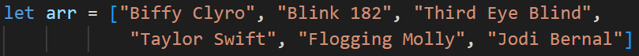
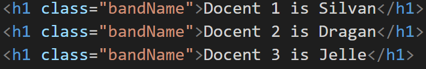
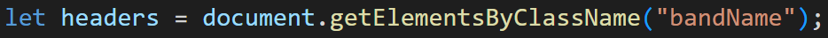
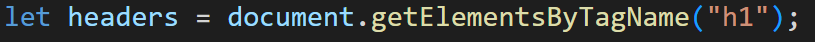
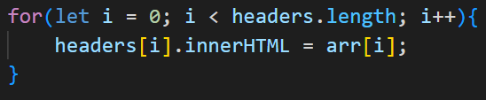
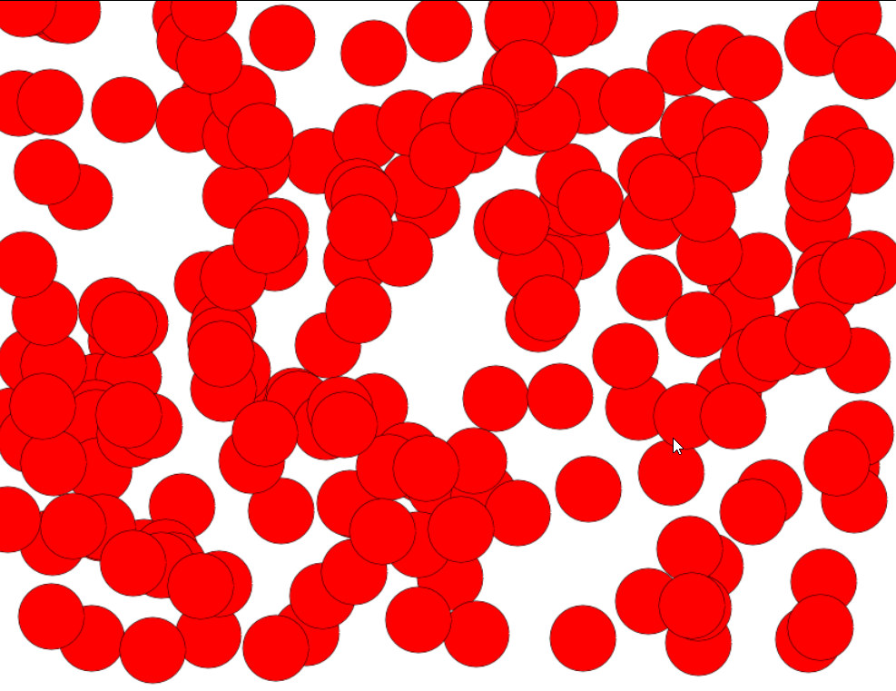

## Files opzetten
1. Maak een map aan genaamd `les 5 Loops en Arrays` Zet in deze map 2 mappen.
 
 1 Canvas
 2 HTML

In beide mappen maak je de volgende bestanden aan.
 * `index.html`
 * `app.js`
Maak voor de html paginas lege pagina's. Gebruik hiervoor de `!` shortcut.
In beide `app.js` zet je het volgende:


# Opdracht 1: Headers veranderen

Voor deze opdracht gaan we in de HTML folder werken.
In deze opdracht gaan we enkele headers van tekst veranderen.We gaan voornamelijk werken in het app.js bestand, in de runApplication functie.

## Stap 1: Zet headers (h1) in de html
Zet een stuk of 5 headers in jouw html bestand.

## Stap 2: Maak een array
Een array is ook een datatype voor een variabele. Het is een lijst met allemaal waardes. Maak een array met jouw favoriete muziek artiesten. Bijvoorbeeld: 

Maak jouw eigen array met favoriete artiesten.

## Stap 3: Print de array uit. 
Om te testen of de array goed is, print deze array uit. Maak gebruik van `console.log()`
We hebben nu een lijst met artiesten, en als deze worden uitgeprint weten we zeker dat de uitgevoerd wordt.

## Stap 4: Verzamel alle headers in een array
We hebben alle headers nodig uit de HTML pagina om ze aan te kunnen pakken. We kunnen op 2 verschillende manieren de headers pakken. Wat we dan krijgen is een array van de headers. Kies 1 van de twee onderstaande methodes uit.

### A (de nette manier): Gebruik maken van (html) classes)
In het HTML bestand voorzie alle h1’s van een class, bijvoorbeeld artiestNaam.

Pak al deze headers met deze class naam.


### B (de minder nette manier): Pak gewoon alle h1s
In het HTML bestand gaan we alle h1 tags pakken. Dit is geen nette manier van werken, want wanneer je meer content en headers hebt in jouw HTML bestand zal deze javascript code jouw HTML bestand slopen.


De variabele genaamd headers bevat nu een array (lijst) van alle headers die we gaan aanpassen.

## Stap 5: Verander alle tekst in de headers (h1’s)
De bedoeling van de opdracht is dat we alle headers veranderen naar onze favoriete artiesten. In de code hebben we nu een array met alle headers, en we hebben een array van onze favoriete artiesten.
Nu gaan we alle tekt in de headers veranderen. 
Als we de tekst van een header willen veranderen moeten we de innerHTML eigenschap van het object aanpassen. Bijvoorbeeld:
```js 
headers[0] .innerhtml = “Lennie Briscoe”;
```
Met headers[0] pakken we de eerste header in de lijst van de headers. Als we de tweede header uit de lijst willen pakken gebruiken we headers[1] enzovoorts.

Om alle headers aan te passen gaan we 1 voor 1 door de headers heen en passen deze aan. Dit kunnen we handmatig doen.
```js
Headers[0].innerHTML = arr[0];
Headers[1].innerHTML = arr[1];
Headers[2].innerHTML = arr[2];
Headers[3].innerHTML = arr[3];
```

Maar als we tientallen headers hebben wordt het een klein probleem. Als we honderden headers hebben wordt het een groot probleem. Daarom gaan we het door de arrays heen lopen automatiseren. Er zijn meerdere loops die we kunnen gebruiken, maar wij gaan een for loop gebruiken.



# Opdracht 2: (Veel) Cirkels tekenen

We gaan de canvas vullen met 200 cirkels op willekeurige plekken. Het eindresultaat komt er ongeveer zo uit te zien: 


## Stap 1: Teken cirkel functie
Maak een functie genaamd `tekenCirkel`. Laat deze functie een cirkel tekenen wanneer deze aangeroepen wordt. Zorg ervoor dat je de X en de Y positie van de cirkel kan *meegeven als **argument***.
Hoe je een cirkel tekent kan je terug vinden in de opdracht over functies. Daar kan je ook terug kijken hoe je functies hebt gemaakt.

## Stap 2: For loop
Maak een *for loop* die 200 keer iets uit voert.
Roep hier in de `tekenCirkel` functie aan. Geef voor de x en de y waardes willekeurige getallen mee.

## Optioneel:
Kijk of je misschien ook de grootte van de cirkels of de kleur van de cirkels willekeurig kan maken.

# Klaar?
Commit en push je werk naar github
