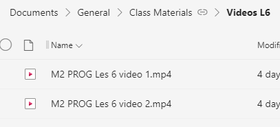
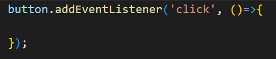

## Files opzetten
1. Maak een map aan genaamd `les 6 events` Zet in deze map 2 mappen.
 
 * Canvas
 * HTML

In beide mappen maak je de volgende bestanden aan.
 * `index.html`
 * `app.js`
Maak voor de html paginas lege pagina's. Gebruik hiervoor de `!` shortcut.
In beide `app.js` zet je het volgende:

# Opdracht 1: Bewegende Rechthoek
Ga in de canvas map werken.
Kijk en volg de videos.

zie teams->general->files->Videos les 6

# Opdracht 2: Meer HTML
In deze opdracht gaan we een button functionaliteit geven. Wanneer er op de knop wordt gedrukt komt er text op de pagina.

## Stap 1: HTML
Maak in de HTML een button aan. Geef deze button de id `myButton`.

## Stap 2: Javascript
Geef de button een event wanneer er op geklikt wordt. 

* Pak in de javascript de button, maak hierbij gebruik van `document.getElementById()`
* Geef de button een eventListener.

* Print `Hello world` uit in de console wanneer er op de knop gedrukt wordt.

## Stap 3: Content toevoegen
Wanneer er op de knop gedrukt wordt, wordt er een nieuwe paragraaf met tekst aangemaakt. Gebruik eventueel Lorem Ipsum. Maak gebruik van [deze methode om in javascript HTML inhoud te maken](https://www.w3schools.com/js/js_htmldom_nodes.asp)

## Extra: Knoppen
In plaats van een stuk tekst toe te voegen, voeg een knop toe. Wanneer je op de knop drukt, komt er een nieuwe knop.

# Klaar?
Commit en push je werk naar github
