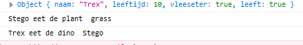

# Opdrachten debugging

## Mappen aanmaken

1. Ga naar waar jouw school werk staat
2. Ga naar de map/directory `M2 prog js`
3. kopieer `les 1` en verander de naam naar `classes`

## class aanmaken

we gaan nu class aanmaken, voor nu nog in `app.js` (later mag dat niet meer)
1. type het volgende over:

2. bekijk even die `contructor`, weet je nog wat dat was? zo niet check de presentatie
3. In de `constructor` gaan we de eigenschappen van de `dino` maken
4. begin met de naam:

5. zie je dat we op 2 plekken aanpassingen maken?
6. maak nu nog meer `eigenschappen`:
* `vleeseter`, een `bool`
* `leeftijd`, een `nummer`

7. Check: heeft jouw constructor nu 3 argumenten (denk aan functions!)?
* naam
* vleeseter
* leeftijd

## instantie maken

nu hebben we onze `dino` en gaan we die testen

Dat doen we in onze `App` in de `runApplication`

1. type het volgende over:

2. nu hebben we 1 dino, zie je het volgende in de console?

3. Maak er nu nog `2 dino's` bij, geef de `variabel` een `goede naam` (die van de dino)
4. zorg dat er minimaal 1 planten eter is

## functions

We gaan nu iets gaan doen met de `vleeseter`

1. maak een `Plant` class:
* geef deze een eigenschap `naam` die als `argument` in de constructor`()` staat

2. geef de `Dino` class nieuwe eigenschappen:
* `leeft` een bool
* deze zet je altijd op `true`.
* hij komt niet als `argument` in de constructor`()`

* `honger` een bool
* deze zet je altijd op `true`.
* hij komt niet als `argument` in de constructor`()`

3. geef de `Dino` class een nieuwe `function`:
* eetDino, 1 argument een dino
* eetDino zet `leeft` op de dino die wordt gegeten op `false`

* eetDino gebruikt `console.log` om te schrijven:

4. geef de `Dino` class nog een nieuwe `function`:
* eetPlant, 1 argument een plant
* eetPlant gebruikt `console.log` om te schrijven:

## functions gebruiken

1. Maak een plant aan in onze `App` in de `runApplication`
2. laat eerst de planteter dino de plant eten
3. laat dan een vleeseter dino de planteter dino eten:

## Extra:

1. geef je `App` class een constructor
2. Zorg nu dat je dino's en je plant eigenschappen van `App` worden
* je mag ook `arrays` gebruiken!
3. in `runApplication` laat je de dino's weer eten, je moet wat dingen veranderen (`this`) 

## klaar?

1. commit & push je werk naar github
