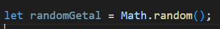
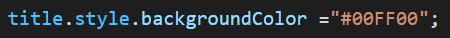
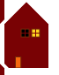

# Opdrachten If Else

## Mappen aanmaken

1. Ga naar waar jouw school werk staat
2. Ga naar de map/directory `M2 prog js`
Uit de vorige les!
3. Maak een map `functions`
4. Open de `functions` folder in visual studio code

## files opzetten

1. Kopieer files van de les1 naar 
 `functions`

 * `index.html`
 * `app.js`

2. open de directory `functions` in visual studio code

## html 

blijft hetzelfde

## javascript 

1. open app.js
2. maak een `variable` met de naam `title` (tip: `let eenVariableNaam = ...;`)
3. gebruik de `document.getElementById("...")` om voor deze variabel de tag op te halen
4. TIP kijk goed naar welke `id` je op de `...` moet invullen!
5. we gaan nu een random introduceren:

* [zie ook w3schools random](https://www.w3schools.com/JS/js_random.asp)

##  if else gebruiken:

Met het random getal gaan we de achtergrond kleur van de title aanpassen.
de random geeft een getal van `0.0-0.999999...` terug.
wij delen deze in 4 gebieden op:
* precies 0
* kleiner dan 0.2
* van 0.2 tot en met 0.6
* groter dan 0.6

1. gebruik de `if, else if en else` om te kijken of `randomGetal` in 1 van deze gebieden zit
2. per gebied geef je een andere achtergrond kleur aan de title

TIP zoek zelf even op het internet hoe je kleuren in html zet

## Is er iemand thuis?

We gaat nu je huisje aanpassen
1. zorg dat je een aantal ramen hebt.
2. gebruik `random` om en getal te maken van 0 tot 1
3. test met een `if else` of je het raam met licht aan of uit moet tekenen

## klaar?

1. commit & push je werk naar github
