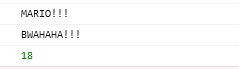
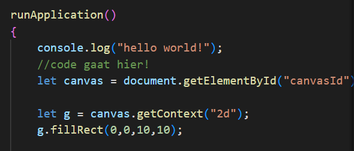
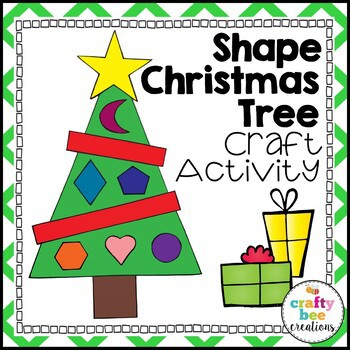

# Opdrachten If Else

## Mappen aanmaken

1. Ga naar waar jouw school werk staat
2. Ga naar de map/directory `M2 prog js`
Uit de vorige les!
3. Maak een map `functions`
4. Open de `functions` folder in visual studio code

## files opzetten

1. Kopieer files van de les1 naar 
 `functions`

 * `index.html`
 * `app.js`

2. open de directory `functions` in visual studio code

## javascript 

1. open app.js
2. nu verschillende functions aan in je class:

* een function die "MARIO!!" naar de console print `(geen argumenten geen return)`
* een function die "BWAHAHA!!!" returned `(geen argumenten)`
* een function die 2 getallen bij elkaar optelt en returned `(2 getallen als argumenten)`
* verzin er zelf nog 1 bij

3. roep nu alle functions aan in `runApplication`
4. voor de `return` functions vang het resulaat in een `variabel` en `console.log` die `variabel`
5. controller je resultaat in de developer console

TIP: vergeet `this.` niet!

## huisje

1. Ga naar waar jouw school werk staat
2. Ga naar de map/directory `M2 prog js`
3. Open de `canvashuis` folder in visual studio code

We gaan nu onze huis teken code in een `aparte function` zetten

Zie je de `let g` daar? die bestaat `alleen` in `runApplication`

Die moeten we als argument doorgeven!

1. maak een nieuwe `function` met de naam `tekenHuis` in je `App` class
2. verhuis (`knip plak`) je huis teken code naar deze nieuwe `function`
3. geef de `function` een argument `g` (zonder let!)
4. roep de `function` aan in je `runApplication` (vergeet `this.` niet!)

## boompje?

Een huis moet ook een kerstboom hebben in deze tijd

1. maak een nieuwe `function` met de naam `tekenKerstBoom` in je `App` class
2. geef de `function` een argument `g` (zonder let!)
3. roep de `function` aan in je `runApplication` (vergeet `this.` niet!)

4. vul de function in zodat deze een boom gaat teken:

* De boom heeft minimaal een stam, naalden, 10 ballen of sterren en een piek.
* Je mag de boom uiteraard aanvullen met allerlei extra’s zoals slingers, kaarsjes , zuurstokken , kado’s, kinderen , katten etc…
* Maak vooral iets wat je zelf leuk vind om te tekenen.

* [circle tekenen](https://www.w3schools.com/html/html5_canvas.asp)

## Extra!

Maak de `function` voor de boom nu eens zo dat je de `locatie (x,y)` en `aantal kerstballen` kan doorgeven als `argument`. maak het zo dat de kerstballen random in de bal gehangen worden. 

## klaar?

1. commit & push je werk naar github
