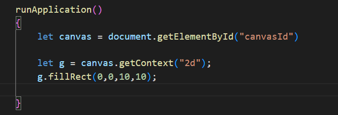
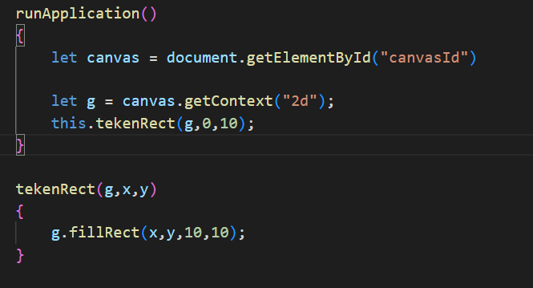
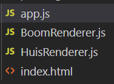

# Opdrachten modules

## Mappen aanmaken

1. Ga naar waar jouw school werk staat
2. Ga naar de map/directory `M2 prog js`
Uit de vorige les!
3. Maak een map `modules`
4. Open de `modules` folder in visual studio code

## files opzetten

1. Kopieer files van het `canvashuis` naar 
 `modules`

 * `index.html`
 * `app.js`

2. open de directory `modules` in visual studio code

3. open app.js
4. controlleer of je `functions` hebt gemaakt voor `tekenHuis` en `tekenBoom`. Zo nee? moet je die maken (zie de les opdrachten van `functions`)

wordt:

## javascript 

we gaan nu ons `huis render code` de `boom render code` naar `aparte` files verhuizen

1. maak met visual studio code 2 nieuwe files aan:

* HuisRenderer.js, maak hierin een nieuwe class HuisRenderer
* BoomRenderer.js, maak hierin een nieuwe class BoomRenderer

2. verhuis nu de `tekenHuis` en `tekenBoom` naar de renderers.

3. nu werkt je app niet meer. Want we moeten importeren:
* import {WAT} from "./WELKEFILE.js"
4. importeer beide render classes
5. gebruik nu je render classes waar je `tekenHuis` en `tekenBoom` gebruikt

TIP! vergeet niet een `variable` te maken en de `new App()` constructie te gebruiken bv
`let huisRenderer = new HuisRenderer();`

## andere bomen

we gaan BoomRenderer aanpassen:
1. maak in `BoomRenderer.js` een nieuwe `class` aan en noem deze `BoomVariantRenderer`
2. maak in `BoomVariantRenderer` een function `tekenBoom` 
3. in `tekenBoom` laat je een andere boom tekenen (bijvoorbeeld een vierkante)
4. gebruik nu in je `App.js` ook `BoomVariantRenderer` om nog een boom te tekenen (deze ziet er dus anders uit)

TIP! nu moet je dus beide classes (`BoomRenderer` en `BoomVariantRenderer`) importeren

## random & for

1. probeer nu met een `for loop` en een `Math.random()` de huizen en bomen te plaatsen

Het resultaat als je wat meer laat tekenen:

## Extra:

heb je nog meer dingen in je kerst dorp gezet? Bv een slee, kerstman of een sneeuwpop
- maak daar ook renderers voor!
- Zijn er nog andere dingen waarvoor je classes in aparte files kan maken? probeer het!
## klaar?

1. commit & push je werk naar github
